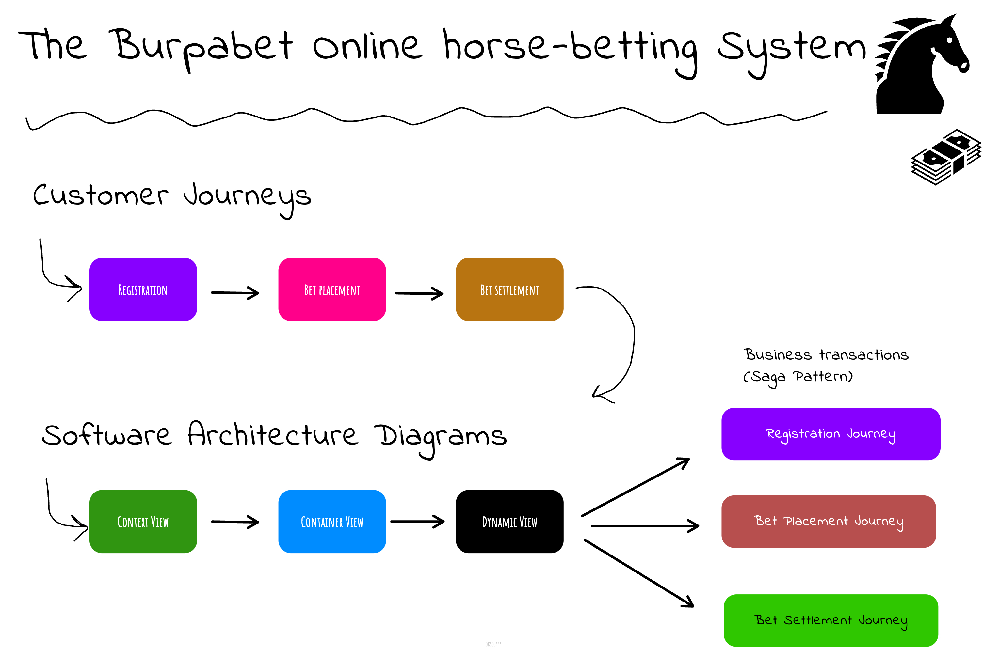

# Burp-a-bet 

Welcome to Burp-a-Bet - an online, voice-activated horse betting system _demo_ based on CockroachDB, Kafka 
and Spring Boot. 

Actually, there's only imaginary voice activation since its done by keystrokes via a shell, but anyway. 

The system is designed to demonstrate different architectural patterns and mechanisms in the context 
of an Online Sports Betting use case. The system provides three separate and independent 
microservices to together support the following main customer journeys:
 
- **Customer Registration** - where a player registers with a sports game operator (horse racing only)
- **Bet Placement** - where a player wagers a bet on a specific game (track and horse)
- **Bet Settlement** - where open bets placed on a race are settled with wins/losses

# How it works

See the documentation section below for details.

# Building and Running

The project builds executable JAR files for each deployable component or microservice. 
These JAR files runs on any platform for which there is a Java 17+ runtime.
                 
## Prerequisites

### Building

- Java 17 JDK
    - https://openjdk.org/projects/jdk/17/
    - https://www.oracle.com/java/technologies/downloads/#java17
- Maven 3+ (optional, embedded wrapper available)
    - https://maven.apache.org/

### Running

- Java 17 JRE
- CockroachDB 23.1+
  - https://www.cockroachlabs.com/docs/releases/
- Kafka 3.6+
  - https://kafka.apache.org/downloads

## Setup

Install the JDK (Ubuntu example):

    sudo apt-get install openjdk-17-jdk

Install the JDK (MacOS example using sdkman):

    curl -s "https://get.sdkman.io" | bash
    sdk list java
    sdk install java 17.0.. (pick from list) 

Confirm the installation by running:

    java --version

### Clone the project
                             
    git clone git@github.com:cockroachlabs-field/burp-a-bet.git burp-a-bet

### Build the executable jars

    cd burp-a-bet
    chmod +x mvnw
    ./mvnw clean install

The executable jars are now found under each respective module's `target` directory.

### Create the databases

Create the following databases for each service (localhost example):

    cockroach sql --insecure --host=localhost -e "CREATE database burp_wallet"
    cockroach sql --insecure --host=localhost -e "CREATE database burp_customer"
    cockroach sql --insecure --host=localhost -e "CREATE database burp_betting"

Enable [change feeds](https://www.cockroachlabs.com/docs/stable/create-and-configure-changefeeds#enable-rangefeeds):

    cockroach sql --insecure --host=localhost -e "SET CLUSTER SETTING kv.rangefeed.enabled = true"

### Setup Kafka

Kafka Streams is required to help drive the distributed business transactions on top
of CockroachDB CDC outbox events.

You can either use a manged Kafka cluster or a local self-hosted setup. In the latter case, 
just follow the [quickstart](https://kafka.apache.org/quickstart) guidelines to setup 
a vanilla Kafka instance.

Ensure kafka is available to the app services and CockroachDB nodes at the default port `9092`:

    kafka://localhost:9092

Example setup using Kraft:

    curl https://dlcdn.apache.org/kafka/3.6.1/kafka_2.13-3.6.1.tgz -o kafka_2.13-3.6.1.tgz
    tar -xzf kafka_2.13-3.6.1.tgz
    ln -s kafka_2.13-3.6.1 current
    cd current
    KAFKA_CLUSTER_ID="$(bin/kafka-storage.sh random-uuid)"
    bin/kafka-storage.sh format -t $KAFKA_CLUSTER_ID -c config/kraft/server.properties

Start daemon:

    bin/kafka-server-start.sh -daemon config/kraft/server.properties

Tail a topic, in this case `registration`:

    bin/kafka-console-consumer.sh --topic registration --from-beginning --bootstrap-server localhost:9092 --property print.key=true

All topics:

| Topic                | Purpose                                                |
|----------------------|--------------------------------------------------------|
| registration         | Registration events published by customer-service      |
| placement            | Placement events published by betting-service          |
| settlement           | Settlement events published by betting-service         |
| wallet-registration  | Registration reply events published by wallet-service  |
| wallet-placement     | Placement reply events published by wallet-service     |
| wallet-settlement    | Settlement reply events published by wallet-service    |
| betting-registration | Registration reply events published by betting-service |
| customer-placement   | Placement reply events published by customer-service   |
| customer-settlement  | Settlement reply events published by customer-service  |

These topics are created on-demand when starting the services.
During service bootstrap, the CockroachDB change feeds are also created 
for the outbox table of each service. Most event publications go through
the transactional outbox pattern.

## Running Locally

Burp-a-bet provides both built-in command line shells and REST (hypermedia driven) API endpoints
in each service.  

The shell is used for demo purposes to initiate the different journeys. The REST 
APIs are for observability and for command completion in the shells.

Start the services in three separate shell sessions using the 
default Spring profiles (order doesn't matter):

    ./run-customer.sh
    ./run-wallet.sh
    ./run-betting.sh
    
Now you should have all three services up and running locally and listening
on the following ports:

| Service  | Shell | API / Front-end       | Capability                                                                                  |
|----------|-------|-----------------------|---------------------------------------------------------------------------------------------|
| customer | yes   | http://localhost:8090 | Orchestrates the registration journey                                                       |
| wallet   | yes   | http://localhost:8091 | Manages monetary accounts for customers and operators using a double-entry financial ledger |
| betting  | yes   | http://localhost:8092 | Orchestrates the bet placement and settlement journeys                                      |

You can verify with curl:

    curl 'http://localhost:8090' -i -X GET
    curl 'http://localhost:8091' -i -X GET
    curl 'http://localhost:8092' -i -X GET

_Hint: if you are using Chrome, then [Json Viewer](https://chromewebstore.google.com/detail/json-viewer/gbmdgpbipfallnflgajpaliibnhdgobh) is a must-have._

## Custom Parameters

See [common-application-properties](http://docs.spring.io/spring-boot/docs/current/reference/html/common-application-properties.html) on how to 
tailor the application context. All parameters can be overridden through
the CLI. 

For example:

    java -jar betting-service.jar \
        --spring.profiles.active=local,verbose \
        --spring.datasource.url=jdbc:postgresql://localhost:26257/burp_betting?sslmode=disable"

## Usage

Type `help` in the different shells for command guidance.

### Customer Service
 
The customer service orchestrates the registration journey. Upon a registration, an outbox event is sent to the wallet and betting service.
These services do their stuff and either approves or rejects the registration. 

At registration:

- The betting service validates the jurisdiction.
- The wallet service creates a customer account and operator account if needed, and grants a registration bonus.

If both services accept, the registration is approved. If any rejects it, the customer 
service sends a rollback request.

At rollback:

- The betting service does nothing.
- The wallet service reverts the welcome bonus but keeps the accounts.

To register 10 customers (default is 1), type:

    register --count 10

For more help, type:

    help register

### Wallet Service

The wallet service does not orchestrate any journeys. It provides a financial ledger
using double-entry principles and an account plan for customers and operators. 

Operators have _liability_ accounts that can have a negative balance. Customers have 
_expense_ accounts that can only have a positive balance. Funds are transferred only between operator and customer
accounts, thus the total balance of all accounts must always equal zero.

For more help, type:

    help

### Betting Service

The betting service orchestrates the bet placement and settlement journeys. 

**Bet placement**

Upon placing a bet, an outbox event is sent to the wallet and customer service.
These services do their stuff and either approves or rejects the placement.

At placement:

- The customer service validates the spending budget is not exceeded (spending limit).
- The wallet service reserves the bet wager from the customers account (if enough funds) to the operator account.

If both services accept, the placement is approved. If any rejects it, the betting
service sends a rollback request.

At rollback:

- The customer service returns the acquired spending credits.
- The wallet service reverts the bet wager and moves funds back to the customer account.

To place 10 bets for a random customer on a random race, type:

    place-bet --count 10

To settle all bets, type:

    settle-bets

For more help, type:

    help place-bet
    help settle-bets

## Key Invariants

In terms of measuring correct execution and outcomes during disruptions and/or contention, 
these are the main invariants to observe:

Wallet service:

- Total sum of all accounts must be zero
- Customer accounts must always have a balance of zero or higher
- Operator accounts can have both positive and negative balance

Betting service:

- Settled bets are marked as `settled` after payouts are transferred to customer account.
- Bet wagering can only be done against unsettled races.

Customer service:

- Customers spending budget must always be positive.

## Additional Documentation

- [High-Level Design](docs/DESIGN.md) - Details including architectural patterns and mechanisms.
- [Service Description](docs/diagrams.okso) - Using [C4 model](https://c4model.com/) diagrams drawn with the [okso](https://okso.app/) app _(open the file with the app)_.
- [Registration Journey Diagram](docs/registration-sequence.txt) - Using a [websequence](https://www.websequencediagrams.com/) diagram.

# Terms of Use

See [MIT](LICENSE.txt) for terms and conditions.

