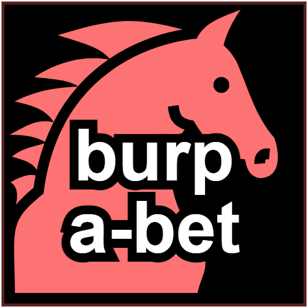
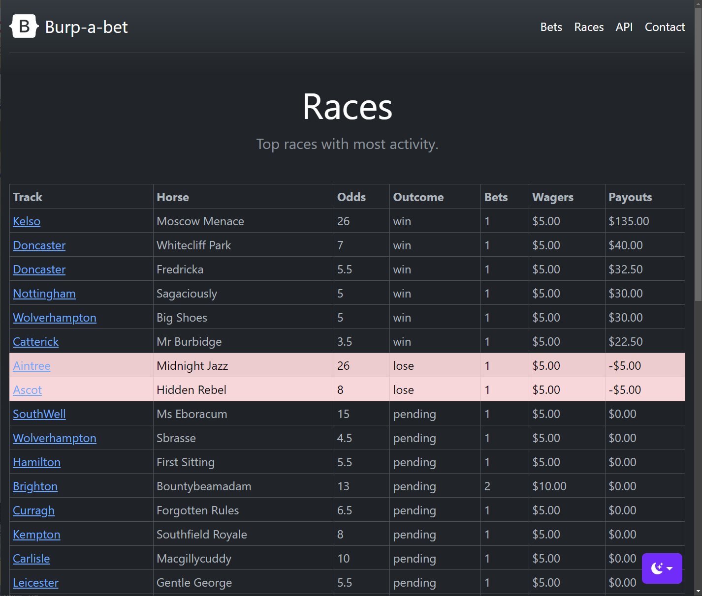

# Burp-a-bet 

Welcome to Burp-a-Bet - an online, voice-activated horse betting system _demo_ based on CockroachDB, Kafka 
and Spring Boot. 

Actually, the voice activation is imaginary and bets are instead placed by keystrokes through shell commands 
or API requests. In theory thought it could be.

# Introduction

The system is designed to _demonstrate_ different architectural patterns and mechanisms in the context 
of an Online Sports Betting use case. The purpose is not to accurately model the full domain complexity of 
sports betting but to give an idea of how such systems are crafted using [CockroachDB](https://www.cockroachlabs.com/) 
as the database of choice.

The system provides three separate and independent microservices that together supports the following 
customer journeys:
 
- **Customer Registration** - where a player registers with a game operator (horse racing only)
- **Bet Placement** - where a player wagers a bet on a specific game (track and horse)
- **Bet Settlement** - where open bets are settled with a win or loss
                    
Screenshot of the `betting-service` web UI:

# Design Features

To promote service autonomy, independence and transactional integrity, all journeys (business transactions) 
are modelled using [Sagas](https://microservices.io/patterns/data/saga.html) with the orchestration method. 

All services maintain their local state in an isolated database using [ACID](https://en.wikipedia.org/wiki/ACID) 
guarantees and local transactions. The message exchange between the services are effectively journey state 
transitions. These messages through the transactional outbox pattern where 
[CDC queries](https://www.cockroachlabs.com/docs/stable/cdc-queries) are used in combination 
with [Kafka stream joins](https://kafka.apache.org/documentation/streams/) to pair together requests with responses.  

In summary, this makes the journeys fully asynchronous but still safe from a transactional standpoint. See 
the rule invariants section below for the meaning of _safe_ in this context.

This system demonstrates the following mechanisms in CockroachDB:

* [CDC Queries](https://www.cockroachlabs.com/docs/stable/cdc-queries) - where each service have an outbox table and a CDC query that sends events to Kafka.
* [Row-level TTL eviction](https://www.cockroachlabs.com/docs/v23.2/row-level-ttl) - that deletes expired outbox keys.
* [Follower reads](https://www.cockroachlabs.com/docs/v23.2/follower-reads) - used by REST endpoints to inspect betting and race data without interfering with ongoing journeys (causing retries).
* [Multi-region (optional)](https://www.cockroachlabs.com/docs/v23.2/table-localities#regional-by-row-tables) - using regional-by-row to pin accounts and bets to specific jurisdictions. 
* Computed virtual columns and enum types

All three services provide an interactive shell and a [REST API](https://roy.gbiv.com/untangled/2008/rest-apis-must-be-hypertext-driven)
using the [HAL+forms](https://rwcbook.github.io/hal-forms/) hypermedia type.

The shells are used to initiate the different journeys above and other management tasks. The APIs are used for
observability and also for initiating journeys using HTTP requests through cURL / Postman or similar tools.

# Building and Running

The project builds executable JAR files for each deployable component or microservice. These JAR files runs 
on any platform for which there is a Java 17+ runtime.
                 
## Prerequisites

### Building

- Java 17 JDK
    - https://openjdk.org/projects/jdk/17/
    - https://www.oracle.com/java/technologies/downloads/#java17
- Maven 3+ (optional, embedded wrapper available)
    - https://maven.apache.org/

### Running

- Java 17+ JRE
- CockroachDB 23.1+ with an Enterprise License
  - https://www.cockroachlabs.com/docs/releases/
- Kafka 3.6+
  - https://kafka.apache.org/downloads

## Setup

Install the JDK (Ubuntu example):

    sudo apt-get install openjdk-17-jdk

Install the JDK (MacOS example using sdkman):

    curl -s "https://get.sdkman.io" | bash
    sdk list java
    sdk install java 17.0..  

Confirm the installation by running:

    java --version

### Clone the project
                             
    git clone git@github.com:kai-niemi/burp-a-bet.git burp-a-bet

### Build the executable jars

    cd burp-a-bet
    chmod +x mvnw
    ./mvnw clean install

The executable jars are now found under each respective module's `target` directory.

### Create the databases

Create the following databases for each service (localhost example):

    cockroach sql --insecure --host=localhost -e "CREATE database burp_wallet"
    cockroach sql --insecure --host=localhost -e "CREATE database burp_customer"
    cockroach sql --insecure --host=localhost -e "CREATE database burp_betting"

Enable [change feeds](https://www.cockroachlabs.com/docs/stable/create-and-configure-changefeeds#enable-rangefeeds):

    cockroach sql --insecure --host=localhost -e "SET CLUSTER SETTING kv.rangefeed.enabled = true"

### Setup Kafka

Kafka Streams is required to help drive the distributed business transactions on top
of CockroachDB CDC outbox events.

You can either use a manged Kafka cluster or a local self-hosted setup. In the latter case, 
just follow the [quickstart](https://kafka.apache.org/quickstart) guidelines to setup 
a vanilla Kafka instance.

Ensure kafka is available to the app services and CockroachDB nodes at the default port `9092`:

    kafka://localhost:9092

Example setup using Kraft:

    curl https://dlcdn.apache.org/kafka/3.6.1/kafka_2.13-3.6.1.tgz -o kafka_2.13-3.6.1.tgz
    tar -xzf kafka_2.13-3.6.1.tgz
    ln -s kafka_2.13-3.6.1 current
    cd current
    KAFKA_CLUSTER_ID="$(bin/kafka-storage.sh random-uuid)"
    bin/kafka-storage.sh format -t $KAFKA_CLUSTER_ID -c config/kraft/server.properties

Depending on your network setup you may need to edit the following Socket 
properties in `config/kraft/server.properties`:

    listeners=PLAINTEXT://..
    advertised.listener=PLAINTEXT://

Start daemon:

    bin/kafka-server-start.sh -daemon config/kraft/server.properties

Tail a topic, in this case `registration`:

    bin/kafka-console-consumer.sh --topic registration --from-beginning --bootstrap-server localhost:9092 --property print.key=true

#### Multi-region Deployments

For multi-region deployments, there are prepared `multi-region.sql` files in each service that will 
setup table localities and partitions based on the [Jurisdiction](burpabet-common/src/main/java/io/burpabet/common/domain/Jurisdiction.java) 
enum type.

Its advised also to use separate regional kafka clusters and the geo-filter the outbox table changefeeds 
accordingly by adding a region predicate:

    .. WHERE crdb_region = 'aws-eu-west-1'

## Running Locally

Burp-a-bet provides both built-in command line shells and REST (hypermedia driven) API endpoints
in each service.  

The shell is used for demo purposes to initiate the different journeys. The REST 
APIs are for observability and for command completion in the shells.

Start the services in three separate shell sessions using the 
default Spring profiles (order doesn't matter):

    ./run-customer.sh
    ./run-wallet.sh
    ./run-betting.sh
    
Now you should have all three services up and running locally and listening
on the following ports:

| Service  | Shell | API / Front-end       | Capability                                                                                  |
|----------|-------|-----------------------|---------------------------------------------------------------------------------------------|
| customer | yes   | http://localhost:8090 | Orchestrates the registration journey                                                       |
| wallet   | yes   | http://localhost:8091 | Manages monetary accounts for customers and operators using a double-entry financial ledger |
| betting  | yes   | http://localhost:8092 | Orchestrates the bet placement and settlement journeys                                      |

You can verify with curl:

    curl 'http://localhost:8090' -i -X GET
    curl 'http://localhost:8091' -i -X GET
    curl 'http://localhost:8092' -i -X GET

_Hint: if you are using Chrome, then [Json Viewer](https://chromewebstore.google.com/detail/json-viewer/gbmdgpbipfallnflgajpaliibnhdgobh) is a must-have._

## Custom Parameters

See [common-application-properties](http://docs.spring.io/spring-boot/docs/current/reference/html/common-application-properties.html) on how to tailor the application context. 
All parameters can be overridden through the CLI. 

For example:

    java -jar wallet-service.jar \
    --spring.profiles.active=local \
    --spring.datasource.url="jdbc:postgresql://my_fancy_cluster.aws-eu-north-1.cockroachlabs.cloud:26257/burp_wallet?sslmode=verify-full&sslrootcert=$HOME/Library/CockroachCloud/certs/<uuid>/cluster-name-ca.crt" \
    --spring.datasource.username=burp \
    --spring.datasource.password=*** \
    --spring.kafka.bootstrap-servers=<kafka-local-ip>:9092 \
    --spring.flyway.placeholders.cdc-sink-url=kafka://<kafka-public-ip>:9092 \
    $*

To run any of the service in the background without an interactive shell, you can 
put the above in a script and use the `--noshell` arg:

    nohup ./run-wallet.sh --noshell > wallet.txt &

## Usage

Type `help` in the different shells for command guidance.

### Customer Service
 
The customer service orchestrates the registration journey. Upon a registration, an outbox event is sent to the wallet and betting service.
These services do their stuff and either approves or rejects the registration. 

At registration:

- The betting service validates the jurisdiction.
- The wallet service creates a customer account and operator account if needed, and grants a registration bonus.

If both services accept, the registration is approved. If any rejects it, the customer 
service sends a rollback request.

At rollback:

- The betting service does nothing.
- The wallet service reverts the welcome bonus but keeps the accounts.

To register 10 customers (default is 1), type:

    register --count 10

For more help, type:

    help register

### Wallet Service

The wallet service does not orchestrate any journeys. It provides a financial ledger
using double-entry principles and an account plan for customers and operators. 

Operators have _liability_ accounts that can have a negative balance. Customers have 
_expense_ accounts that can only have a positive balance. Funds are transferred only between operator and customer
accounts, thus the total balance of all accounts must always equal zero.

For more help, type:

    help

### Betting Service

The betting service orchestrates the bet placement and settlement journeys. 

**Bet placement**

Upon placing a bet, an outbox event is sent to the wallet and customer service.
These services do their stuff and either approves or rejects the placement.

At placement:

- The customer service validates the spending budget is not exceeded (spending limit).
- The wallet service reserves the bet wager from the customers account (if enough funds) to the operator account.

If both services accept, the placement is approved. If any rejects it, the betting
service sends a rollback request.

At rollback:

- The customer service returns the acquired spending credits.
- The wallet service reverts the bet wager and moves funds back to the customer account.

To place 10 bets for a random customer on a random race, type:

    place-bet --count 10

To settle all bets, type:

    settle-bets

For more help, type:

    help place-bet
    help settle-bets

## API Testing

The services also provide REST APIs for initiating the bet placement, bet settlement and registration journeys.

### Registration

First request a form template:

    curl -X GET http://localhost:8090/api/registration > registration.json

Post back the form to the self href specified in the response:

    curl -d "@registration.json" -H "Content-Type:application/json" -X POST http://localhost:8090/api/registration

### Bet Placement

First request a form template:

    curl -X GET http://localhost:8092/api/placement > place-bet.json

Then adjust the IDs in the form. Note that you need to supply a valid customer UUID that
you can get from the customer service API. There's also an optional idempotency key. If
omitted, there will be one placement per request. If not omitted, the placements are
de-duped.

Post back the form to the self href specified in the response:

    curl -d "@place-bet.json" -H "Content-Type:application/json" -X POST http://localhost:8092/api/placement

### Bet Settlement

First request a form template:

    curl -X GET http://localhost:8092/api/settlement/form > settle-bets.json

Post back the form to the self href specified in the response:

    curl -d "@settle-bet.json" -H "Content-Type:application/json" -X POST http://localhost:8092/api/settlement

## Rule Invariants

In terms of measuring correct execution and outcomes during disruptions and/or contention, 
these are the main business rule invariants to observe:

Wallet service:

- Total sum of all accounts must always be zero
- Customer accounts must always have a balance of zero or higher
- Operator accounts can have both positive and negative balance

Betting service:

- Settled bets are marked as `settled` after payouts are transferred to customer account.
- Bet placement can only be done against registered customer accounts.
- Bet wagering can only be done against unsettled races.

Customer service:

- Customers spending budget (like a rate limit) must always be positive.

## Additional Documentation

- [Design Notes](docs/README.md) - Details including architectural patterns and mechanisms.
- [Service Description](docs/diagrams.okso) - [C4 model](https://c4model.com/) diagrams drawn with [okso](https://okso.app/) app _(open the file using the app)_.
- [Registration Journey Diagram](docs/registration-sequence.txt) - Using a [websequence](https://www.websequencediagrams.com/) diagram.

# Terms of Use

See [MIT](LICENSE.txt) for terms and conditions.
