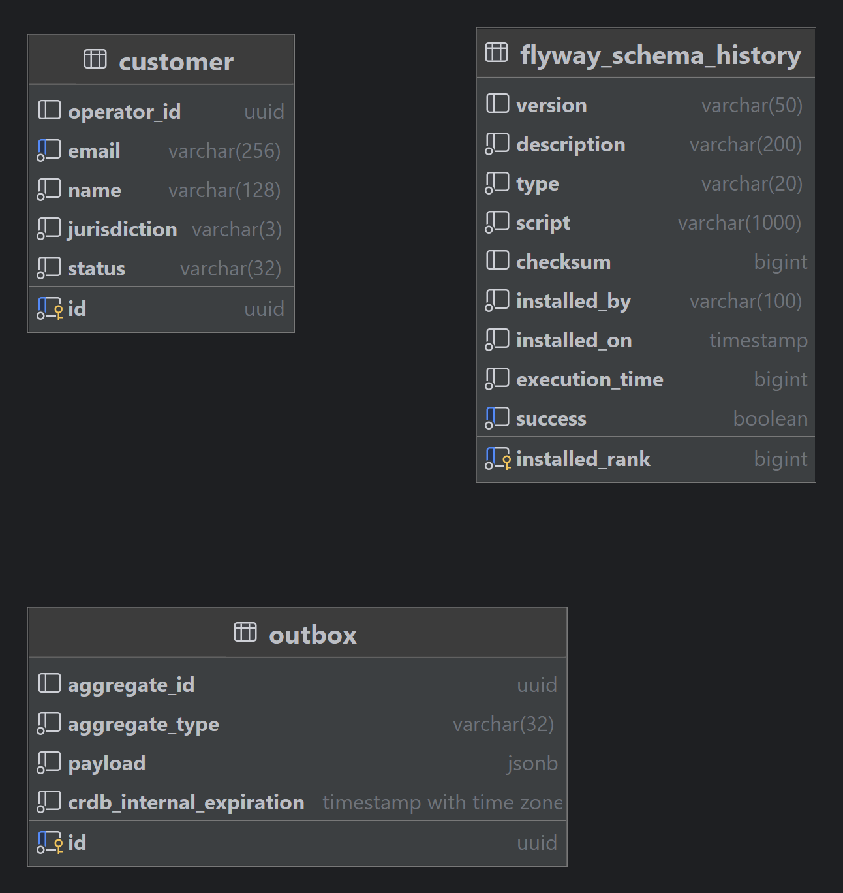
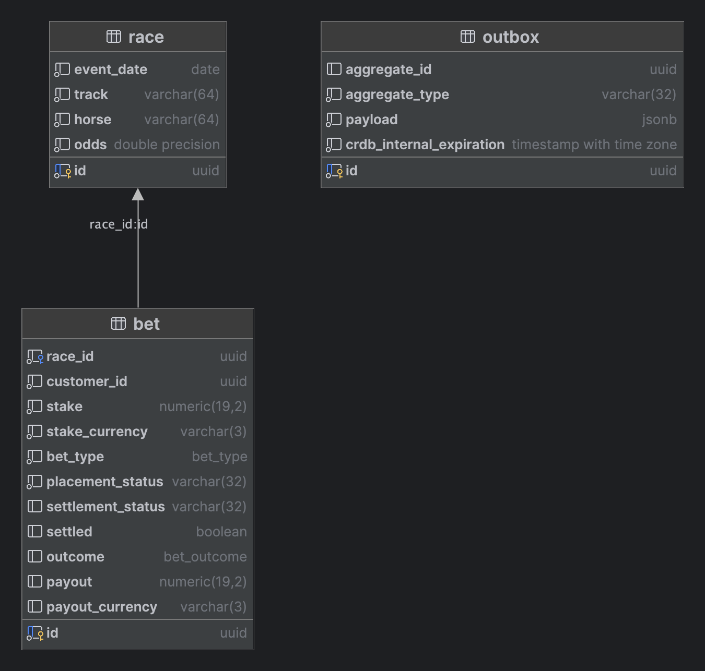

# Design Notes

Burp-a-bet is based on a typical lightweight, self-contained and stateless Spring Boot application architecture. 
To promote service autonomy, independence and availability, all journeys aka business transactions
are modeled using [Sagas](https://microservices.io/patterns/data/saga.html) using the orchestration method.

Think of this pattern as a decomposed two-phase commit protocol providing eventual consistency between
independent service through asynchronous message exchange. This fits well into the microservice architecture
style where strong ACID transactions are typically scoped to the bounded contexts. Journeys spanning
between services are typically coordinated asynchronously without ACID / blocking protocols to promote
decoupling, scalability and availability.

The downside with Saga's is that it adds complexity to the architecture and blurs out the state
transitions in customer journeys, making it less visible and harder to trace flows. There are plenty
of different application frameworks for using Saga's at a larger scale. This demo however focuses
mainly on the primitives for using Saga's including message passing and local ACID transactions.

All services maintain their local state in an isolated database using [ACID](https://en.wikipedia.org/wiki/ACID) guarantees and
local transactions. The message exchange between the services are customer journey state transitions.
Messages are passed through the transactional outbox pattern where [CDC queries](https://www.cockroachlabs.com/docs/stable/cdc-queries) are used in
combination with [Kafka stream joins](https://kafka.apache.org/documentation/streams/) to stitch together requests with responses.

This makes the journeys fully asynchronous and transactionally safe in terms of safeguarded rule
invariants. The outbox pattern, for example, guarantees at-least-once semantics in the message passing
and that no events are emitted if transactions fail. There can't be any out-of-sync message passing
where an event is emitted and then the transaciton rolls back. See the rule invariants section below
for a more precise meaning of _safety_ in this context.

In summary, the system demonstrates the following mechanisms in CockroachDB:

* [CDC Queries](https://www.cockroachlabs.com/docs/stable/cdc-queries) - each service has an outbox table and CDC projection query to send events to Kafka.
* [Row-level TTL eviction](https://www.cockroachlabs.com/docs/v23.2/row-level-ttl) - deletes expired outbox event records.
* [Follower reads](https://www.cockroachlabs.com/docs/v23.2/follower-reads) - used by REST endpoints to inspect betting and race data without interfering with ongoing
  journeys (causing retries).
* [Multi-region (optional)](https://www.cockroachlabs.com/docs/v23.2/table-localities#regional-by-row-tables) - using regional-by-row to pin accounts and bets to specific jurisdictions.
* Computed virtual columns and enum types

All three services provide an interactive shell and a [REST API](https://roy.gbiv.com/untangled/2008/rest-apis-must-be-hypertext-driven) using the [HAL+forms](https://rwcbook.github.io/hal-forms/) hypermedia type.

The interactive shells are used to initiate the different journeys described above and other management tasks.
The APIs are used for observability and also for initiating journeys using HTTP requests through cURL /
Postman or similar tools.

## Architectural Mechanisms

Architectural mechanisms are used to realize architectural requirements. These can be divided into three levels 
of refinement: Analysis mechanisms, design mechanisms and implementation mechanisms. The table below shows three 
categories of architectural mechanisms and shows how they are expressed in each of these categories.

| Analysis               | Design                   | Implementation                                                                        | Constraints and Characteristics                                                                                                                                                                                                                                                                                 |
|------------------------|--------------------------|---------------------------------------------------------------------------------------|-----------------------------------------------------------------------------------------------------------------------------------------------------------------------------------------------------------------------------------------------------------------------------------------------------------------|
| Persistence            | RDBMS                    | CockroachDB                                                                           | Cockroach Cloud dedicated. Multi-region supported by not required. Enterprise license needed to unlock key features like CDC.                                                                                                                                                                                   | 
| Data Access            | ORM                      | JPA, Hibernate, JDBC, Spring Data                                                     | Services use JPA for ORM persistence with Hibernate as the persistence provider and Spring Data JPA as main abstraction. For simpler data access, plain JDBC is used through the Spring JDBC template.                                                                                                          | 
| Transaction Management | RDBMS                    | Local data source transactions (no XA) and outbox events.                             | Services lean on ACID guarantees within their bounded contexts. Business transactions are eventually consistent and driven by the Saga orchestration and transactional outbox patterns using CockroachDB and Kafka Streams in concert. AOP aspects are used for session attributes and producing outbox events. | 
| Versioning             | RDBMS                    | Online schema upgrades, Flyway                                                        | Flyway is used to maintain database schema versions. CockroachDB provides online schema upgrades with zero downtime.                                                                                                                                                                                            | 
| Interoperability       | HTTP/REST                | Spring HATEOAS / Hypermedia APIs                                                      | Spring MVC, Spring Hateoas using HAL+json media type                                                                                                                                                                                                                                                            | 
| Observability          | HTTP/Logging             | SLF4J + Logback via Spring, Spring Boot Actuators, TTDDYY datasource proxy logging.   |                                                                                                                                                                                                                                                                                                                 | 
| Resource Management    | HTTP/Pooling             | HikariCP for connection pooling, data retention using CockroachDB TTLs.               | Provides support for the management of expensive resources, such as database connections. TTLs to evict expired outbox events.                                                                                                                                                                                  | 
| Eventing               | Commit Log and Streaming | Kafka Streams used to link request and response topics.                               |                                                                                                                                                                                                                                                                                                                 | 
| Web Server             | Embedded Container       | Embedded Jetty servlet container.                                                     |                                                                                                                                                                                                                                                                                                                 | 
| Load Balancing         | L4 / L7                  | L4 load balancer between app instances and CockroachDB. L7 in front of app instances. | (Optional) Any load balancer, for example HAProxy in self-hosted.                                                                                                                                                                                                                                               | 
| Platform and Build     | Java                     | JDK 21                                                                                | JDK 21 language level (OpenJDK compatible).                                                                                                                                                                                                                                                                     | 
| Frontend               | HTML+CSS, Shell          | Bootstrap 3 + Thymeleaf and/or Spring Shell                                           | For applicable services.                                                                                                                                                                                                                                                                                        | 

# Wallet Service

The service uses the following entity model for double-entry bookkeeping of monetary transaction history.

[V1_0__create.sql](../wallet-service/src/main/resources/db/migration/V1_0__create.sql)

- **account**  - Accounts with a derived balance from the sum of all transactions
- **transaction**  - Balanced multi-legged monetary transactions
- **transaction_item** - Association table between transaction and account representing a leg with a running account
  balance.

# Customer Service

The service uses the following entity model for double-entry bookkeeping of monetary transaction history.

[V1_0__create.sql](../customer-service/src/main/resources/db/migration/V1_0__create.sql)

- **customer**  - Customer registrations

# Betting Service

The service uses the following entity model for double-entry bookkeeping of monetary transaction history.

[V1_0__create.sql](../betting-service/src/main/resources/db/migration/V1_0__create.sql)

- **race**  - A race at a given track, with a given horse and the decimal odds
- **bet**  - A customer bet for a given race

# Appendix: Kafka Topics

These topics are created on-demand when starting the services. During a service bootstrap phase, the CockroachDB 
change feeds are also created (through Flyway) for the outbox table of each service. Most event publications 
go through the transactional outbox pattern.

| Topic                | Purpose                                                |
|----------------------|--------------------------------------------------------|
| registration         | Registration events published by customer-service      |
| placement            | Placement events published by betting-service          |
| settlement           | Settlement events published by betting-service         |
| wallet-registration  | Registration reply events published by wallet-service  |
| wallet-placement     | Placement reply events published by wallet-service     |
| wallet-settlement    | Settlement reply events published by wallet-service    |
| betting-registration | Registration reply events published by betting-service |
| customer-placement   | Placement reply events published by customer-service   |
| customer-settlement  | Settlement reply events published by customer-service  |

